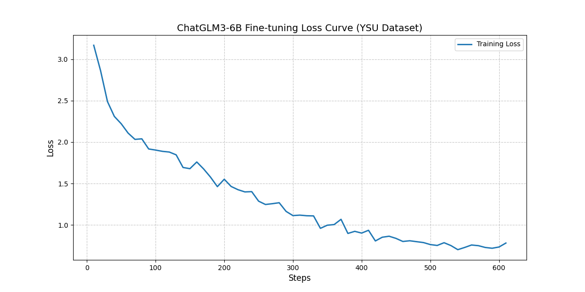
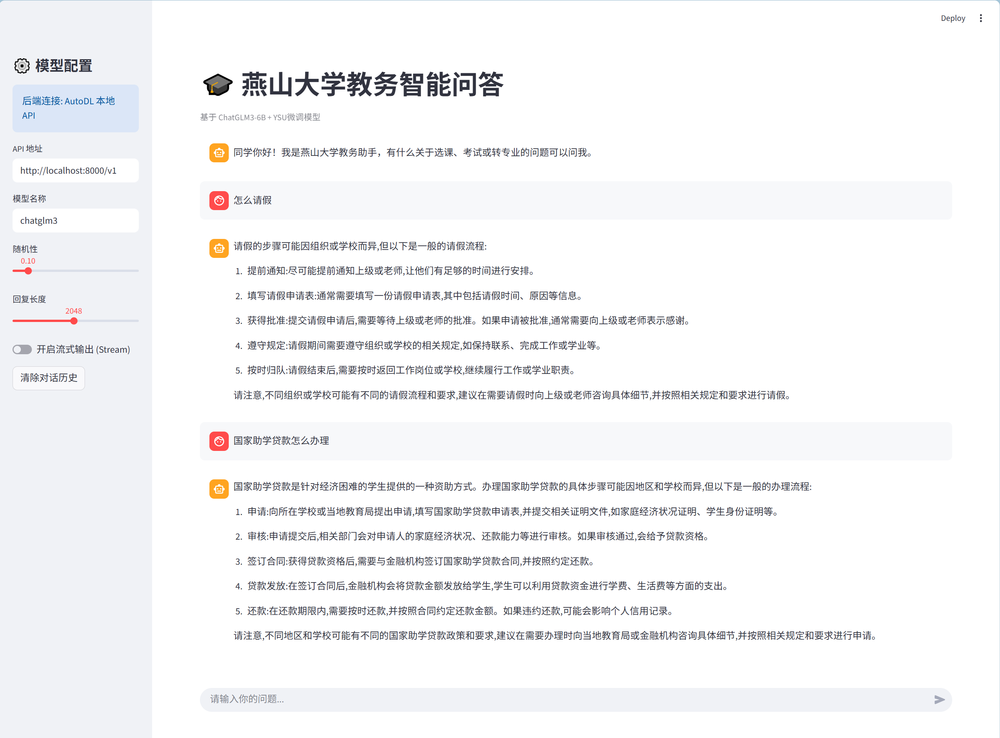

# YSU 教务智能问答大模型 (YSU-QA-BM)

基于 ChatGLM3-6B 与 LoRA 微调，面向燕山大学教务场景的智能问答助手，支持 vLLM 推理与 Streamlit 前端。

## 🚀 项目简介

在 AutoDL 算力云上完成训练与部署，使用 `LLaMA-Factory` 进行微调；推理采用 `vLLM` 加速，前端采用 `Streamlit`。

## 📂 目录结构（节选）

- `web/app.py`: Streamlit 前端 Web 界面代码
- `download_model.py`: 模型下载脚本（从 ModelScope 或 Hugging Face 下载）
- `data/ysu.json`: 微调数据集（燕大教务问答数据）
- `LLaMA-Factory/`: 微调用到的框架与脚本
- `README.md`: 项目说明
- `training_loss.png`: 训练损失曲线图
- `web.png`: 前端界面截图

> 注：仓库包含多个模型目录（如 `ysu_merged_model`、`ysu_finetuned_model_v2`），请选择与当前部署一致的路径。

## 🛠️ 快速开始

### 1. 环境准备
建议使用已创建的虚拟环境：
```bash
source vllm_env/bin/activate
pip install -r ysu/requirements.txt
pip install -r LLaMA-Factory/requirements.txt
```

如需额外依赖，请参考 `LLaMA-Factory/README.md` 与本仓库的 `ysu/requirements.txt`。

### 2. 下载模型（可选）
如果尚未下载或准备好基座模型，可执行：
```bash
python download_model.py
```

### 3. 启动后端 API
使用 LLaMA-Factory 提供的 API 启动推理服务（以 ChatGLM3 模型为例）：
```bash
CUDA_VISIBLE_DEVICES=0 API_PORT=8000 llamafactory-cli api \
  --model_name_or_path /root/autodl-tmp/ysu_merged_model_v2 \
  --template chatglm3 \
  --finetuning_type full \
  --infer_backend huggingface
```

> 将 `--model_name_or_path` 替换为你想要加载的模型目录，如 `ysu_merged_model` 或 `ysu_finetuned_model_v2/checkpoint-600`。

### 4. 启动前端页面
前端位于 `web/app.py`：
```bash
streamlit run web/app.py --server.port 6006
```

## 📈 训练过程与效果

### 训练损失曲线

下图展示了微调过程中的训练 loss 变化趋势：



### 前端交互界面

下图为前端页面示例，展示了问答交互与结果展示：



## 📊 微调配置

- 基座模型：ChatGLM3-6B
- 微调方式：LoRA（可在 LLaMA-Factory 中配置）
- 数据集：`data/ysu.json`（燕大教务问答数据）

## 🔧 常见问题

- API 无法启动：检查模型路径是否正确、显存是否充足；尝试切换 `--infer_backend` 或降低 `max_new_tokens`。
- 前端连接失败：确认后端端口（默认 8000）与前端配置一致，网络安全组放通端口。
- 包版本冲突：优先使用仓库内的 `requirements.txt` 并在虚拟环境中安装。

## 📜 许可与致谢

本项目基于 `ChatGLM3-6B` 与 `LLaMA-Factory`，仅供学习与科研使用。感谢相关开源社区的贡献。

